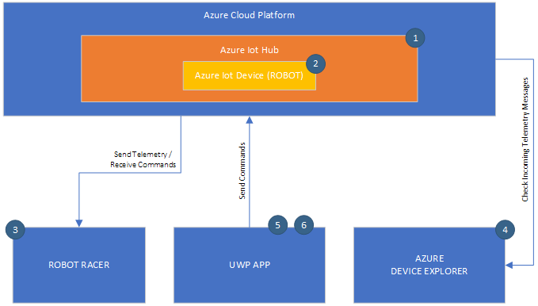
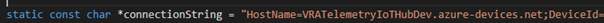
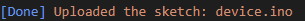
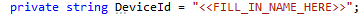
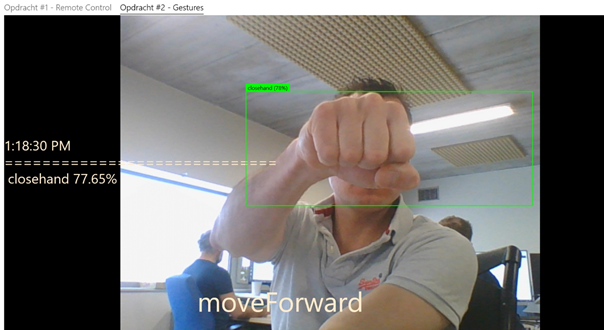
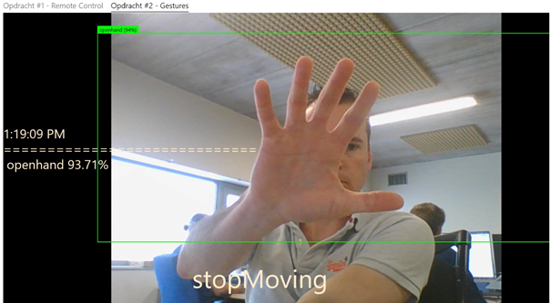
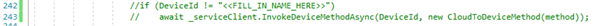

# VanRoey.be Sneak Peek 2019 IoT Challenge
Welcome to our VanRoey.be Sneak Peek challenge. Are you up for it? Does your team own the skills to become todays winner? 
The main goal of this challenge is to steer a robot over a finish line. This can be done by connecting your robot to Microsoft’s cloud platform, Microsoft Azure. Let’s not waste too much time and get to action!

## Challenge scenario

The challenge consists of three main components:
1.	Connect the robot to the Azure platform (robot will spin left for an instance)
2.	Steer the robot back pointing forward using a Windows Universal App connected to the cloud
3.	Move the robot over the finish line using gesture control -> winner!

Have a quick overview of the following diagram to understand the used Architecture and dataflow:

Below steps will be explained troughout this tutorial, do not take action yet, just read trough the steps and continue:
1.	Create Azure IoT Hub
2.	Create Azure IoT Device in the IoT Hub
3.	Connect Azure IoT Device to the IoT Hub (Cloud)
4.	Check Telemetry messages from device to cloud with the Azure Device Explorer
5.	Steer the robot Left/Right with the UWP App
6.	Move the robot racer forward by using gesture control on the UWP App

## Connect the Robot to the Cloud

An IoT Hub is already created for you as this is somewhat time consuming. TheAzure IoT Hub is an enriched Event Hub and will be served as gateway to your custom business applications. You can use this “hub” to receive high loads of Telemetry messages and send Cloud to Device Messages (commands).

### Create a device registration in Azure
1.	Go to the Azure Portal (https://portal.azure.com/) and login using your provided credentials if needed
2.	In the Search bar on the top of the screen, look for your already created IoT Hub “DustEaterHub” or “DarkKnightHub” and go to the found resource
3.	Click the IoT devices tab and Add a new IoT Device
4.	In the Device ID field, fill in the name of your Robot Racer “DustEater” or “DarkKnight”
5.	Leave all other fields as is and click the Save button
6.	Now go to the newly created device (click it!) and copy the Connection string (primary key)

### Upload your code and Connection String to the Robot Racer
1.	To save some time, the code for your Robot Racer is already downloaded from the Git repo onto your machine under C:\Temp\VRASneakPeek, navigate to that folder and go to the folder of your Robot Racer “DarkKnight” or “DustEater”, then go to the Wifi folder
2.	Open the project.code-workspace file, Visual Sudio Code should now open
3.	The thing we want to look for here, is the Connection String we copied earlier. Find the following line of code in the device.ino file (line 95 😉)

4.	Change the Connection String into the copied connection string from the Azure portal
5.	Connect your robot racer to your computer, ignore all notifications which are shown on the screen
6.	Click the COM port button (the button which says "COMX") in the right corner of the Visual Studio Code screen and select the shown COM port (Silicon labs) which is listed in the search bar / command palette on the middle TOP of the screen
7.	Hit F1 and select Azure IoT Device Workbench: Upload Device Code
8.	If for some reason the upload fails, just try the upload procedure again
9.	If you get the following notice, all is OK

10.	Now disconnect your racer from the computer and place it on the marked location on the road map / playground
11.	Do NOT plug the USB cable of the Robot Racer in yet!
12.	There is a small button located right next to the battery pack on the racer. Look for it. Turn on the On/Off button of the battery pack on the second level of the Robot Racer! Do not continue without this action!
13.	Now plug in the USB cable of your robot racer
14.	Give it some time, the robot racer will turn left when ready – your robot racer is now connected to the cloud!
15.	To verify this , open the Azure Device Explorer on your computer (located on the Desktop and Task bar)
16.	Go to the Data Tab and Click Monitor
17.	You should see the messages form the device coming in on screen. These messages are coming from the device you created on the IoT Hub. 
18.	Show this screen to the instructor!
If your robot for some reason is rebooting and turning left again, please ask the instructor 😉

## Steer the robot forward using burst movement
Read trough following text and perform the steps listed below:
Now that your robot is connected to the cloud, we need to make sure the robot is pointing forward to get it across the finish line. We will be doing this by using an UWP app which will send Cloud to Device commands to make the robot racer move around.

1.	Open the folder containing your code at C:\Temp\VRASneakPeek and open the VRA.SneakPeek2019.sln file
2.	Visual Studio 2019 Community Edition should now open showing you an UWP app which you will use throughout the rest of this challenge
3.	Go to the Solution Explorer and navigate to the Pages\SamplePage.xaml.cs file
4.	Find the following line and modify your device id in “DustEater” or “DarkKnight”

5.	Now we need to adjust the IoT Hub Connection String (NOT THE DEVICE CONNECTION STRING YOU COPIED BEFORE) in the ServiceClientFactory. Navigate to Factories\ServiceClientFactory.cs and go to the next step to get the connectionstring
6.	Go back to the Azure Portal, go to the landing page of your IoT Hub “DustEaterHub” or “DarkKnightHub”. If you cannot find it, search for it in the Search Bar on the middle top of the screen
7.	When on the landing page, go to the Shared access policies tab and click the iothubowner policy
8.	A navigation pane opens, copy the value of the Connection string—primary key
9.	Paste the value inside your Visual Studio 2019 Community Edition instance
10.	Make sure your current configuration is set to Debug x64
11.	Hit the Run button and make sure the application is maximized
12.	Play around with the arrows, give it some time to respond! Depending on the connectivity the Robot Racer will respond with some latency. Only hit the arrow once will trigger a burst move!
13.	Try to move the robot in a somewhat straight direction pointing to the finish line
14.	When the front of the robot is facing the finish line, show the instructor. 

FYI: If the robot is not fully aligned, it is allowed to align it manually.

## Move the robot forward to the finish line and claim your prize
In order to win the race, the robot racer needs to move over the finish line. We will do this by using gesture control. Images are recorded using the webcam which are at a later time being processed by a model trained with machine learning to capture the context of these images, this technique is called “Object Detection”.

First, some learning is applicable here. Following images show how to steer the robot. A handy trick: moving your hand slightly form point to point can increase detection trough the model. When the model detects the same movement 3 times, the robot will receive a move command.

1.	If your UWP application is still open, go to the second tab ”Opdracht #2 – Gestures”
2.	Click start, this will trigger the webcam to show
3.	Currently, the code to send the commands to the robot is commented out in the SamplePage.xaml.cs file, we will first start the app and play around with it without the real code.
4.	Make SURE you get a good feeling about this. Use your hand and check the different gestures like shown in above picture. It helps to wave a bit (not too much) with your hand and open your fingers very good so the model can understand your movement better. 
5.	Now we will start practicing with the robot racer, stop the application from running and uncomment the following lines of code (DO NOT CHANGE THE DEVICEID HERE) in the SamplePage.xaml.cs file: 

6.	Start the app again, now again browse to the second tab and hit start to start the webcam
7.	FYI: MAKE SURE TO STOP THE ROBOT IN TIME, there is always some delay on the gesture control in combination with the steer robot command. A good tip is to make the robot stop a few times on the road ahead to the finish line to get a good feeling of stopping and starting.
8. When you feel confidend enough, call the instructor to show off your skills!
9. The challenge ends when the robot finishes BETWEEN the finish line. With what you’ve learned above, you should be able to steer the robot forward and make it stop in time 😉
9.	Show you can steer your robot between the finish line! Claim your prize…

